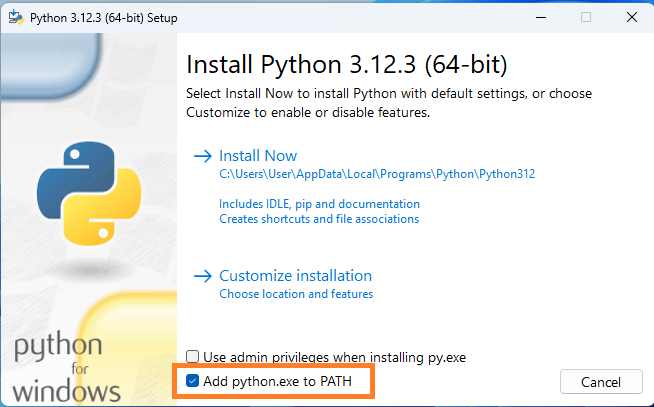
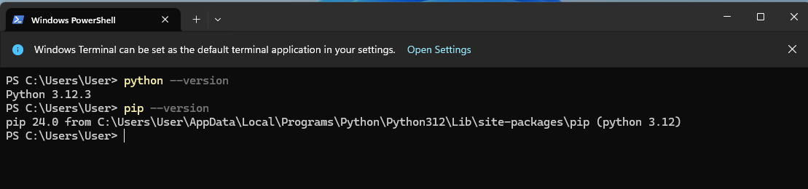

# Installing Python

This guide will help you download and install Python, feel free to use it to download whichever version you want

## Step 1: Download Python

1. Visit the official Python downloads page: [Python Downloads](https://www.python.org/downloads/)
2. Select the Python 3.12.3 release. It is beneficial to install the latest patch version (e.g., 3.12.3) to ensure all security patches and minor updates are included.

## Step 2: Choose the Correct Installer

### For Windows Users:
- Most common choice: **Windows installer (64-bit) for Intel processors**.
- If you are using an ARM64 processor, you will need the corresponding installer.
  - **How to Check Your Processor Type on Windows:**
    - Press `Windows Key + I` to open the Settings app.
    - Navigate to `System` > `About`.
    - Under "Device specifications," look for the "System type" entry. It will state whether your device runs a "64-bit operating system, x64-based processor" (Intel) or "64-bit operating system, ARM-based processor."

### For macOS Users:
- Choose the **macOS 64-bit universal2 installer**. This installer is compatible with Intel, M1, and ARM processor Macs.

## Step 3: Install Python

1. Run the installer you downloaded.
2. Ensure you select the option to **Add Python to PATH** before proceeding with the installation.

3. Click on the `Install` button and follow the prompts to complete the installation.

## Step 4: Verify Installation

1. Open your terminal or command prompt.
2. Verify Python is installed correctly by typing:
    ```bash
    python --version
    ```
3. Verify that pip is installed. This is what we will use to install important libraries later
    ```bash
    pip --version
    ```

