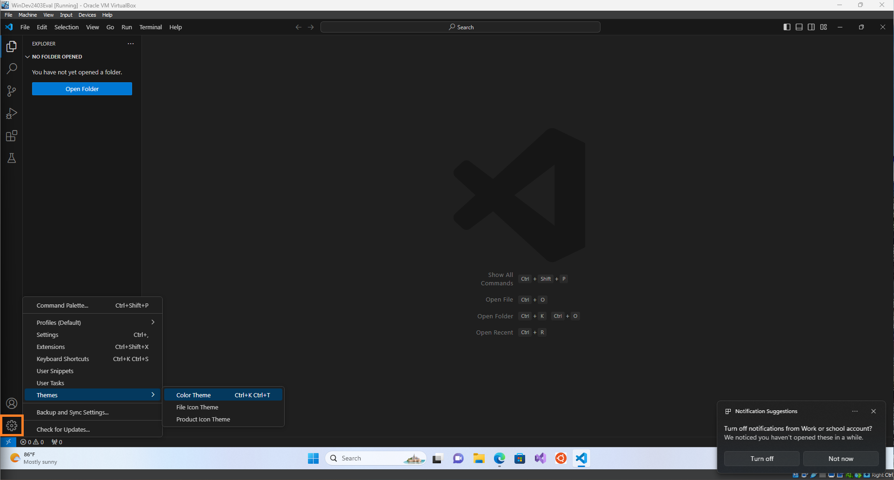
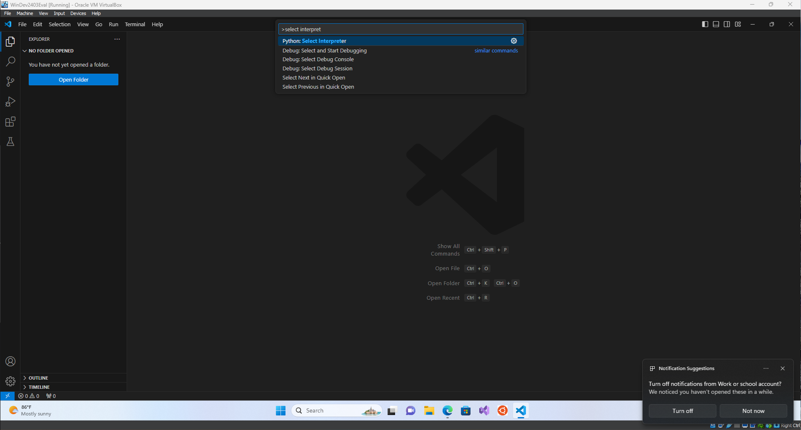

# Installing Visual Studio Code

Visual Studio Code (VS Code) is a powerful and lightweight code editor developed by Microsoft. It supports development in multiple programming languages and comes with a variety of useful features, such as debugging, syntax highlighting, intelligent code completion, snippets, and code refactoring.

## Downloading Visual Studio Code

1. **Visit the Visual Studio Code download page**:
   - Navigate to the [Visual Studio Code download page](https://code.visualstudio.com/Download) to start the process.

2. **Choose the correct version for your operating system**:
   - Visual Studio Code provides different versions for different needs and operating systems. Select the appropriate one for your setup.
   - During install just follow the prompts, and if you want you can "add open with code" action which will let you open vscode from within file folders
   

### For Windows Users:
- **x64 Installer**: Most Windows computers use 64-bit processors. If you have an Intel or AMD processor, choose the x64 version.
- **ARM Installer**: If your computer uses an ARM processor, select the ARM version. This is less common and is usually found in newer, energy-efficient laptops.

   - **User Installer vs. System Installer**:
     - **User Installer**: Recommended for personal installations, installs VS Code in the user's directory.
     - **System Installer**: Requires administrator rights and installs VS Code for all users on the machine.

### For macOS Users:
- **Universal package**: Suitable for both Intel and Apple silicon (M1, M2) chips. This version ensures compatibility regardless of your hardware.
  
   - **Using the ZIP version**:
     - Download the ZIP package.
     - Once downloaded, extract the ZIP file.
     - Drag the extracted folder to your Applications folder to complete the installation.

## Final Steps

3. **Launch Visual Studio Code**:
   - After installation, open Visual Studio Code from your applications directory or start menu.

4. **Customize**:
   - VS Code is highly customizable. Explore the Extensions Marketplace directly within the app to find extensions, such as Python, C++, or Markdown support
   - You can also change the way your editor looks by clicking the settings symbol and going to `Themes`
   

## Configuring Python in Visual Studio Code

5. **Install the Python Extension**:
   - Go to the extensions tab
   - Search for and install the `Python` extension
   

6. **Selecting the Python Interpreter**:
   - After installing the Python extension, open a Python file or just the Command Palette by pressing `Ctrl+Shift+P`.
   - Type `Python: Select Interpreter`, then choose the interpreter you installed earlier. VS Code will use this interpreter for running Python code and debugging.
   

This setup guide provides a basic foundation for using Visual Studio Code for Python development. The same steps can generally be applied to other programming languages by installing the respective extensions for those languages from the VS Code Marketplace.
